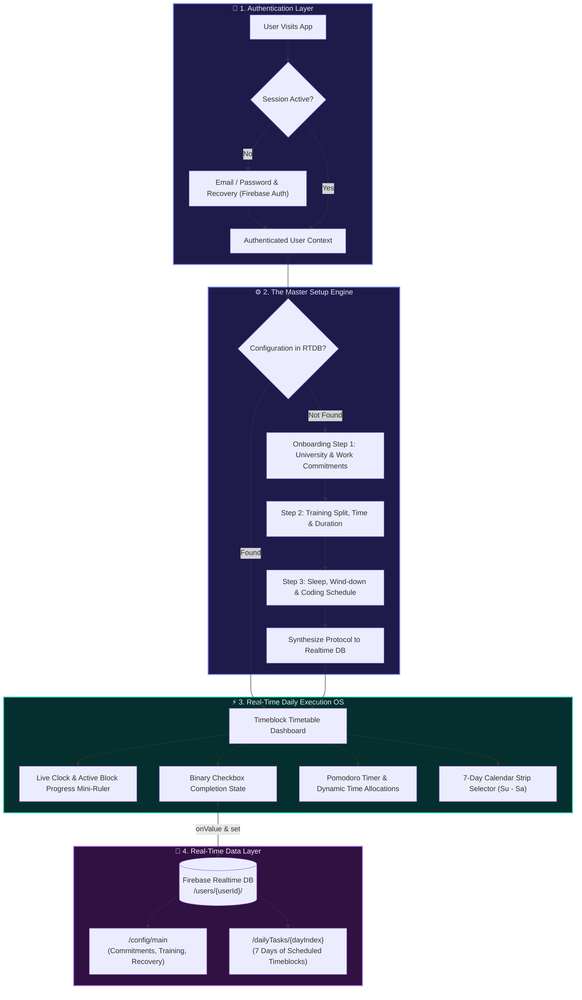
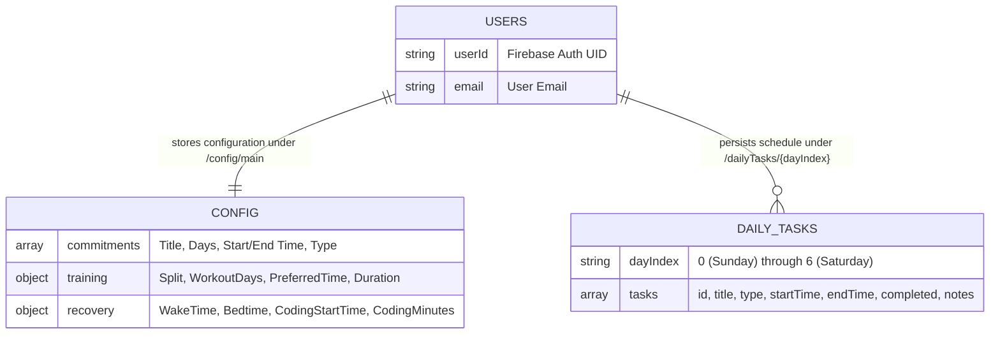

<div align="center">

# 🧠 Mindful Life OS

### *An intelligent, distraction-free scheduling and execution environment designed to eliminate decision fatigue and optimize your daily routine.*

[](https://agent-6ab7632bc0ec0347cb--splendid-longma-57fba3.netlify.app/)
[](https://react.dev/)
[](https://vite.dev/)
[](https://tailwindcss.com/)
[](https://firebase.google.com/)
[](LICENSE)

<br />

🌐 **Live Application:** [agent-6ab7632bc0ec0347cb--splendid-longma-57fba3.netlify.app](https://agent-6ab7632bc0ec0347cb--splendid-longma-57fba3.netlify.app/)

</div>

---

## 🌟 Executive Overview

**Mindful Life OS** is not just another calendar or generic task manager. It is a state-aware, friction-free productivity engine that turns your non-negotiable master schedule into a clean, binary execution checklist. 

By calculating structured weekly baseline templates and synchronizing real-time progress across devices via **Firebase Realtime Database**, it protects your momentum without the cognitive overhead of constant replanning.

```
+-----------------------------------------------------------------------------------------+
|                                    MINDFUL LIFE OS                                      |
|                                                                                         |
|   [ 07:00 ]  Circadian Wake & Morning Protocol                 [ Done: OK ]             |
|   [ 09:00 ]  University Core Block: Software Engineering       [ Active: 42m left ] <-- |
|   [ 17:15 ]  Hypertrophy Training Regimen                      [ Upcoming ]             |
|   [ 19:30 ]  Deep Focus Engineering Block                      [ Upcoming ]             |
|   [ 23:15 ]  Circadian Wind-Down & Sleep Block                 [ Upcoming ]             |
+-----------------------------------------------------------------------------------------+
```

---

## 🏗️ System Architecture & Workflow

The system takes user constraints from the **Master Setup Engine**, generates weekly protocols, and serves a live interactive dashboard synchronized with Firebase RTDB.



---

## 🗄️ Realtime Database Schema

User data is strictly partitioned by user identity under `/users/{userId}/`:



---

## 🚀 Key Modules & Capabilities

| Module | Icon | Description | Tech Highlight |
| :--- | :---: | :--- | :--- |
| **Authentication Flow** | 🔐 | Complete sign-in, account creation, and password reset. Persistent auth listener auto-routes users between auth and dashboard. | `firebase/auth` (`onAuthStateChanged`) |
| **Master Setup Engine** | ⚙️ | One-time onboarding wizard that synthesizes academic, work, workout, and sleep constraints into a 7-day recurring timetable. | Dynamic Protocol Generator |
| **Real-Time Checkbox Dashboard** | ⚡ | Ultra-clean timetable filtered by active time-block. Displays an animated mini-ruler tracking minutes remaining in the active block. | Live countdown & binary toggles |
| **Reactive RTDB Sync** | 🔄 | Instant multi-tab and multi-device state synchronization via WebSocket listeners with fallback local generation. | `firebase/database` (`onValue`, `set`, `ref`) |
| **Pomodoro & Focus Timer** | ⏱️ | Integrated focus timer to preserve flow state and prevent burnout during deep work blocks. | Audio & visual interval alerts |
| **Zero-Leak Security** | 🛡️ | All API keys and database endpoints reside strictly in local `.env.local` files or hosting dashboard settings. Zero secrets in git. | Automated security checks |
| **Production Code Splitting** | 📦 | Vite 8 + Rolldown function-based manual chunks splitting vendor, motion-ui, and firebase libraries for lightning-fast loads. | Sub-2s builds, 235 kB runtime |

---

## 💻 Tech Stack

<div align="center">

| Layer | Technologies |
| :--- | :--- |
| **Frontend Framework** | **React 19**, **Vite 8** (with Rolldown engine) |
| **Styling & UI** | **Tailwind CSS v4** (`@tailwindcss/vite`), **Framer Motion**, **Lucide React** |
| **Authentication** | **Firebase Auth** (Email/Password, Recovery, Sessions) |
| **Data Layer** | **Firebase Realtime Database (RTDB)** with WebSocket sync |
| **Hosting & CI/CD** | **Netlify** (Branch deploys: `main` & `dev`), **Vercel** ready |
| **Typography** | **DM Sans** (Body & Headers), **JetBrains Mono** (Metrics & Timestamps) |

</div>

---

## 📁 Repository Structure

```text
MINDFUL_LIFE_OS/
├── package.json              # Monorepo root workspace scripts (build, dev, preview)
├── vercel.json               # Root Vercel deployment configuration & SPA rewrites
├── netlify.toml               # Netlify build configuration, base dir & SPA redirects
├── .env.example               # Clean environment variable template (no secrets)
├── .gitignore                 # Bulletproof ignore rules (.env*, node_modules, dist)
├── app/                       # Main Production Vite + React Application
│   ├── package.json          # Production dependencies (React 19, Firebase, Tailwind v4)
│   ├── vite.config.js        # Tailwind v4 plugin + Rolldown manualChunks code-splitting
│   ├── index.html            # Dark-mode root HTML with DM Sans & JetBrains Mono fonts
│   ├── vercel.json           # Subfolder Vercel rewrite configuration
│   ├── public/               # Public distribution assets
│   │   ├── favicon.svg       # Calming application icon
│   │   └── icons/            # Thematic illustration icons (gym, sleep, cradle)
│   └── src/
│       ├── App.jsx           # Root application shell
│       ├── BaselineUI2.jsx   # Primary OS Dashboard, Auth & Master Setup implementation
│       ├── BaselineUI_2.jsx  # Alias export for compatibility
│       ├── firebase.js       # RTDB (getDatabase) & Auth initialization with env keys
│       └── index.css         # Tailwind v4 directives & dark theme base rules
├── FOLDER_1_BASIC_UI/        # Prototyping sandbox & component exploration
└── UI DESIGN INSPIRATION/    # High-fidelity design specs & reference mocks
```

---

## 🛠️ Local Development Setup

### Prerequisites
- **Node.js**: `v18.0.0` or higher
- **npm**: `v9.0.0` or higher

### 1. Clone the repository
```bash
git clone https://github.com/abhiruppaul547-commits/-Mindful_Life_OS.git
cd -Mindful_Life_OS
```

### 2. Install dependencies
```bash
# Installs workspace dependencies for app
npm install
```

### 3. Configure Environment Variables
Copy the template into `.env.local` inside the `app/` folder (and optionally at root):
```bash
cp app/.env.example app/.env.local
```

Populate `app/.env.local` with your Firebase credentials:
```env
VITE_FIREBASE_API_KEY=your_firebase_api_key
VITE_FIREBASE_AUTH_DOMAIN=mindful-life-os-database.firebaseapp.com
VITE_FIREBASE_PROJECT_ID=mindful-life-os-database
VITE_FIREBASE_STORAGE_BUCKET=mindful-life-os-database.firebasestorage.app
VITE_FIREBASE_MESSAGING_SENDER_ID=your_messaging_sender_id
VITE_FIREBASE_APP_ID=your_firebase_app_id
VITE_FIREBASE_DATABASE_URL=https://mindful-life-os-database-default-rtdb.firebaseio.com/
```

> [!IMPORTANT]
> Never commit `.env.local` to git. Both root `.gitignore` and `app/.gitignore` explicitly block all `.env*` files to guarantee security.

### 4. Start the development server
```bash
npm run dev
```
Open [http://localhost:5173](http://localhost:5173) in your browser.

### 5. Create a production build & preview locally
```bash
npm run build
npm run preview
```

---

## 🌐 Production Deployment

### Netlify Deployment (Active)
The repository includes a ready-to-use [netlify.toml](file:///netlify.toml):
```toml
[build]
  base = "app"
  publish = "dist"
  command = "npm run build"

[[redirects]]
  from = "/*"
  to = "/index.html"
  status = 200
```

1. Connect your repository in **[Netlify Dashboard](https://app.netlify.com)**.
2. Under **Site configuration > Environment variables**, paste the `VITE_FIREBASE_*` keys.
3. Deploy! Branch deploys are automatically enabled for `dev` and production deploys for `main`.

Live URL: **[agent-6ab7632bc0ec0347cb--splendid-longma-57fba3.netlify.app](https://agent-6ab7632bc0ec0347cb--splendid-longma-57fba3.netlify.app/)**

### Vercel Deployment
The repository includes root [vercel.json](file:///vercel.json) and [app/vercel.json](file:///app/vercel.json) with SPA rewrites:
1. Import the repository into **[Vercel Dashboard](https://vercel.com)**.
2. Root Directory: leave as `./` (or specify `app`).
3. Add the `VITE_FIREBASE_*` environment variables under **Project Settings > Environment Variables**.
4. Deploy!

---

## 🗺️ Roadmap & Upcoming Milestones

- [x] **Firebase Auth**: Sign in, register, and password reset flows
- [x] **Firebase Realtime Database (RTDB)**: Real-time listeners and schedule syncing
- [x] **Tailwind CSS v4 & Dark Mode Engine**: Calming, aesthetic interface with particle physics
- [x] **Vite 8 & Rolldown Code-Splitting**: Vendor chunk optimization
- [ ] **Push Notification Conductor**: Native web notifications when transitioning between time blocks
- [ ] **Off-Grid Mode**: One-tap vacation toggle to suspend productivity tracking without efficiency penalty
- [ ] **Smart Reschedule Logic**: Real-time AI recommendation to push missed blocks to future time slots

---

## 📄 License

Distributed under the **MIT License**. See [LICENSE](file:///LICENSE) for full details.

<div align="center">
  <sub>Built with focus and intentionality for Mindful Life OS.</sub>
</div>
